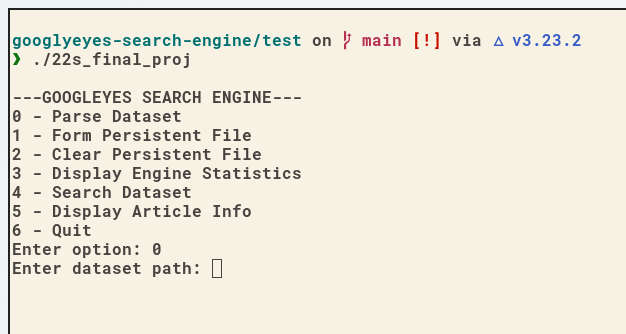

# The Challenge 🎯: Financial Articles Search Engine

This project consisted in building a search engine for a large collection of financial news articles from Jan - May 2018.
The dataset contains more than 300,000 JSON-formatted articles.

The full dataset (compressed) is about 1.3 GB and is available on [kaggle](https://www.kaggle.com/jeet2016/us-financial-news-articles).
For testing purposes we used the following sample [dataset](https://www.dropbox.com/s/ugn3mzgy2ogyqwu/sample_data_sets.zip?dl=0),
available on Dropbox.

# The (Googly-eyes) Team 👨‍🔬 👨‍🔬

- [Pravin Ramana](https://github.com/pravindoesstuff)
- Kassi Bertrand (me)

# Our solution
Our solution is a Command Line Interface(CLI) application, and presents itself as follows:


_**Note**: Our team was not able to implement the persistent file functionality. Consequently, Options 1 and 2
do not work._

# Dependencies, Tools, or Frameworks 🛠️

- [CMake](https://cmake.org/): To compile the project.
- [thread library](https://github.com/progschj/ThreadPool): To distribute work to the available compute cores on our different machines.
- [Stemming library](https://github.com/smassung/porter2_stemmer): For stemming words the search engine will index.

# How to run the project?
To run the project, please follow these steps:

1. Clone this repo:
```shell
git clone https://github.com/kassi-bertrand/googlyeyes-search-engine.git
```
2. Get into the project folder:
```shell
cd googlyeyes-search-engine
```
3. Create a `test` folder and cd into it:
```shell
mkdir test && cd test
```
4. Build and compile the project from the `test` folder:
```shell
cmake .. && make
```
5. Run the program executable:
```shell
./22s_final_proj
```

# Performance Results
Our implementation leverage the cpu threads to keep processing cores as busy as possible. As result, parsing
took significantly less time, here is some performance data:

| Dataset size | 10    | 221   | 6,000 | 300,000 |
|--------------|-------|-------|-------|---------|
| Time(s)      | < 1   | < 1   | 2.78  | 43 - 60 | 

_**Note**: Performance data differed from my machine to my partner's. His machine is faster than mine. So depending on your
machine, you might get different results._

# Coding Conventions

For this project, the team adopted the following conventions to facilitate collaboration:

- ***variable and function names***

Variables and functions name shall follow the *snake case* naming style.
```c++
int variable_name;
int function_name();
```
- ***Class declaration comments***

Class declarations shall be preceded by the following comment:
```c++
/**
 * @Author(s): 
 * @filename: 
 * @date: mm-dd-yyyy
 * @description: 
 */
```
- ***Avoid global namespaces***

Using global namespaces is strictly forbidden.

**NO** ❌
```c++
using namespace std;
cout << "Hello world" << endl;
```

**YES** ✔️
```c++
std::cout << "Hello world" << std::endl;
```

- ***Short commit messages***

Commit messages must be relatively short. Ideally, must do **ONE** thing at a time. Example:

```shell
git commit -m 'Implemented member function X from Class Y'
or
git commit -m 'Fixed seg fault in function Z'
```

- ***Function declaration comments***

function declarations shall be preceded by the following comment:
```c++
    /// \param              -> 
    /// \return             -> 
    /// \description        -> 
```

Example:
```c++
    ///
    /// \param folder       -> Path to a folder withing the filesystem
    /// \return Vector      -> A set of processed JSON (Article objects)
    /// \description        -> Call "parse_json" on EACH JSON file within "folder"
    static std::vector<Article> parse_folder(const std::filesystem::directory_entry &folder);
```

## Useful Links:

- Tutorial on RapidJSON by TA Christian > [here](https://github.com/Gouldilocks/rapidTutorial) <.
- Project Handout > [here](https://docs.google.com/document/d/1210mEIwg2rVnId4POk5gmaWFZ3mD27dts4Kwh4RTBbA/edit?usp=sharing) <.